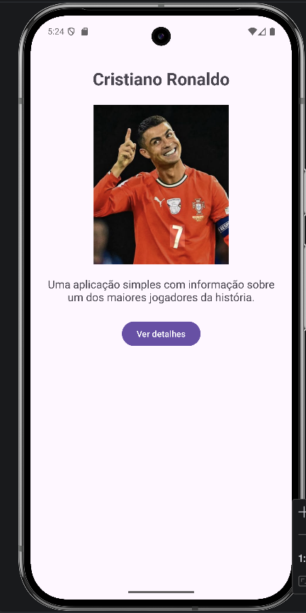
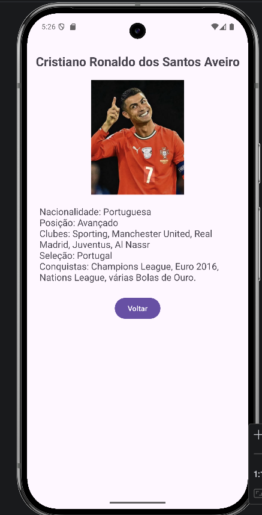

# Assignment X – CR7InfoApp

Course: Mobile Computing
Student(s): Dinis Lino
Date: 15 de Março 2025
Repository URL: https://github.com/dinis6045/CR7-Info-App

---

# CR7InfoApp

CR7InfoApp is a simple Android application developed using **Kotlin** and **Android Studio**.
The goal of this project is to demonstrate basic Android development concepts through a small application that presents information about the football player **Cristiano Ronaldo**.

The project focuses on:

* Kotlin programming fundamentals
* Android Activities
* Layout design with XML
* Navigation between screens
* User interaction

---

# 1. Introduction

This assignment aims to introduce the development of Android mobile applications using Kotlin.

The main objective of the project was to create a small application capable of displaying information about Cristiano Ronaldo through a simple interface with navigation between screens.

Through this project it was possible to apply fundamental Android concepts such as:

* Activities
* Layouts
* Intents
* Event handling
* UI design

The application demonstrates how a basic mobile interface can be built and how users can navigate between different screens.

---

# 2. System Overview

CR7InfoApp is composed of two main screens.

Main features of the application include:

* A main screen presenting the application
* Navigation to a detail screen
* Display of player information
* Simple interface with buttons and text
* Return navigation

## Use Case Example

1. The user launches the application
2. The main screen appears
3. The user presses the **Details** button
4. The application opens the detail screen
5. The user reads additional information
6. The user returns to the main screen

---

# 3. Architecture and Design

The application follows the standard **Android Studio project structure**.

## Project Structure

```
CR7InfoApp
│
├── app
│   ├── java
│   │   └── org.example.cr7infoapp
│   │        ├── MainActivity.kt
│   │        └── DetailActivity.kt
│   │
│   ├── res
│   │   ├── layout
│   │   │    ├── activity_main.xml
│   │   │    └── activity_detail.xml
│   │   │
│   │   ├── drawable
│   │   │    └── images and icons
│   │   │
│   │   └── values
│   │        ├── strings.xml
│   │        ├── colors.xml
│   │        └── themes.xml
│   │
│   └── AndroidManifest.xml
│
└── build.gradle
```

## Architecture Overview

The application uses a **basic Activity-based architecture**.

Main components:

### MainActivity.kt

Responsible for:

* Loading the main screen
* Managing user interaction
* Opening the second screen

### DetailActivity.kt

Responsible for:

* Displaying additional information
* Allowing the user to return to the previous screen

Navigation between screens is done using **Android Intents**.

Example:

```kotlin
val intent = Intent(this, DetailActivity::class.java)
startActivity(intent)
```

---

# 4. Implementation

The application was implemented using the following technologies:

* Kotlin
* Android Studio
* Android SDK
* XML Layouts

Main implementation features include:

* Button click listeners
* Activity navigation
* Layout configuration
* UI elements such as TextViews and Buttons

Example code used in the application:

```kotlin
val detailsButton = findViewById<Button>(R.id.btnDetails)

detailsButton.setOnClickListener {
    val intent = Intent(this, DetailActivity::class.java)
    startActivity(intent)
}
```

---

# 5. Testing and Validation

The application was tested using the **Android Emulator** available in Android Studio.

The following tests were performed:

* Application launch verification
* Layout display verification
* Navigation between activities
* Button interaction validation

The application executed correctly during all tests.

---

# 6. Usage Instructions

To run the project:

1. Clone the repository

```
git clone https://github.com/dinis6045/CR7-Info-App
```

2. Open the project in **Android Studio**

3. Wait for Gradle synchronization

4. Run the application using:

* Android Emulator
  or
* Physical Android device

### Requirements

* Android Studio
* Android SDK
* Kotlin support
* Android Emulator or Android device

---


# Screenshots






# Autonomous Software Engineering Sections

## 7. Prompting Strategy

AI tools were used to assist with:

* Understanding Android Studio features
* Debugging Kotlin code
* Structuring documentation
* Explaining Android concepts

Typical prompts included requests for help with:

* Kotlin syntax
* Android layouts
* Activity navigation
* Debugging errors

---

## 8. Autonomous Agent Workflow

AI tools were used during several development stages.

### Planning

Understanding how the Android project should be structured.

### Coding

Support with Kotlin code examples and Android components.

### Debugging

Solving compilation and runtime errors.

### Documentation

Helping structure the README file and report sections.

---

## 9. Verification of AI-Generated Artifacts

All AI-generated suggestions were verified before being used.

Verification methods included:

* Manual code review
* Running the application
* Testing the functionality in the emulator

Only working and validated code was included in the final version.

---

## 10. Human vs AI Contribution

### Human Contributions

* Creating the Android project
* Implementing activities
* Designing layouts
* Testing the application

### AI Contributions

* Assistance with debugging
* Explaining Android concepts
* Helping structure documentation

---

## 11. Ethical and Responsible Use

AI tools were used strictly as **support tools**.

All generated outputs were reviewed and adapted before inclusion in the final project.

The student remains responsible for the final implementation.

---

# Development Process

## 12. Version Control and Commit History

Version control was managed using **GitHub**.

Multiple commits were made during development to reflect project progression and track changes.

This ensures transparency and traceability of the development process.

---

## 13. Difficulties and Lessons Learned

During the development of the project several challenges were encountered, including:

* Understanding Android project structure
* Working with Activities
* Handling navigation between screens
* Debugging Kotlin errors

Through this assignment valuable experience with Android development and Kotlin programming was gained.

---

## 14. Future Improvements

Possible improvements include:

* Adding more detailed player information
* Improving the interface design
* Adding multimedia content (images or videos)
* Implementing additional screens
* Enhancing the user experience

---

## 15. AI Usage Disclosure (Mandatory)

AI tools used during development:

* ChatGPT

These tools were used for:

* Debugging assistance
* Programming explanations
* Documentation structure

All generated outputs were reviewed and validated before being included in the final project.
